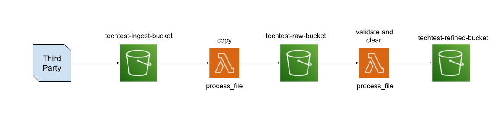

# Tech Test – Serverless Data Ingestion Pipeline

Implements a lightweight, serverless data pipeline using AWS services. 
It shows how to process and transform CSV filesall within the AWS Free Tier.


### Main technologies

- **Terraform**: Infrastructure to manage AWS resources  
- **AWS Lambda**: Python 3.12 function for data processing  
- **AWS S3**: Storage and Data Lake
- **Python**: CSV parsing, AWS interaction  
- **AWS Cloudwatch**: Logs and observability

### Functioning
When a new file is uploaded to the ingest S3 bucket (this is to simuate a third party sending a file), 
this event automatically triggers an AWS Lambda function via an S3 event notification. 
The provided data was intentionally created to include some incorrect entries 
(e.g., improperly formatted email addresses or update dates that are inconsistent with the record creation dates)
The Lambda function first copies the file to the raw bucket for traceability, 
then reads and validates the content (e.g., timestamp logic, email formatting). 
Cleaned records are written to the refined bucket, partitioned by date and hour for query efficiency. 
Invalid rows are stored separately for auditing.

 contains some screenshots to help describe some of the work done.

---


##  Architecture Overview



### Overview:
- **S3 Ingest Bucket (`techtest-ingest-bucket`)**  
  Receives files from external sources. Triggers the Lambda function on file upload.

- **Lambda Function (`process_file_lambda`)**  
  Copies the original file to a raw bucket, performs basic data cleaning, and splits data into "cleaned" and "rejected" outputs.

- **S3 Raw Bucket (`techtest-raw-data-bucket`)**  
  Stores exact copies of ingested files for traceability.

- **S3 Refined Bucket (`techtest-refined-data-bucket`)**  
  Stores processed outputs in partitioned folders by date and hour:
  ```
  refined/date=YYYY-MM-DD/hour=HH/users_cleaned.csv
  refined/date=YYYY-MM-DD/hour=HH/rejected/users_rejected.csv
  ```

---

## Deployment Instructions

### 1. Prerequisites
- AWS CLI installed and configured
- Terraform installed  
- AWS user has the right permissions to create all the resources in the TF files


### 2. Setup

#### Step 1: Package the Lambda
```bash
cd lambda
zip ../build/lambda_function_process_file.zip process_file.py
```

#### Step 3: Deploy Infrastructure
```bash
cd terraform
terraform init
terraform apply
```

---

## Usage

To test the pipeline:

1. Upload a CSV file to `techtest-ingest-bucket`  
2. Lambda is triggered automatically:
   - Copies to `raw`
   - Cleans and writes to `refined` and `rejected`
3. Check S3 for structured output:
   ```
   refined/date=2025-06-24/hour=15/users_cleaned.csv
   refined/date=2025-06-24/hour=15/rejected/users_rejected.csv
   ```

## Git & CI/CD

- Everything was maitaned on Git
  - Added git ignore to avoid committing files that should not be pushed such as .tfstate
- A GitHub Actions workflow is included to lint Python code on push:
  - Checks if the code in the Lambda function code with `flake8` is well formatted
---

##  Possible Future Improvements

- Output to **Parquet** format for better query performance  
- Use **Athena** to query across multiple partitions  
- Add **unit tests** for the Lambda function  
- Introduce **CI/CD pipeline** for Terraform
- If needed a DWH like Redshift can be created to faciliate the analytics work. In that case an additional step will be needed to move data from S3 to Redshift
